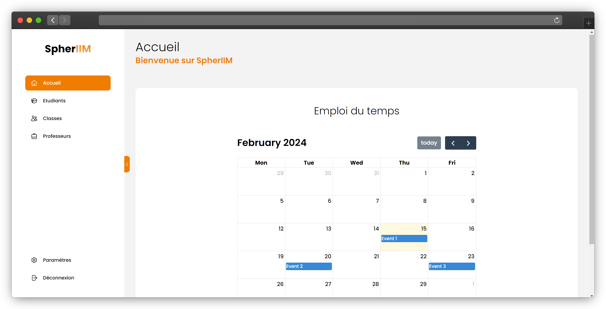

# Spheriim

- [Spheriim](#spheriim)
  - [1. Description](#1-description)
  - [2. Screenshot](#2-screenshot)
  - [3. Diagram and architecture](#3-diagram-and-architecture)
    - [3.1 Diagram](#31-diagram)
    - [3.1.1 Diagram explaination](#311-diagram-explaination)
    - [3.2 Architecture](#32-architecture)
  - [4. Requirements](#4-requirements)
  - [5. How to Install](#5-how-to-install)
    - [5.1 Clone the Repository](#51-clone-the-repository)
    - [5.2 Install Dependencies](#52-install-dependencies)
    - [5.3 Run the Project](#53-run-the-project)
  - [6. Tests](#6-tests)
  - [7. Stack](#7-stack)
    - [7.1 Script \& Logic](#71-script--logic)
    - [7.2 JS Framework](#72-js-framework)
    - [7.3 Style](#73-style)
    - [7.4 DB](#74-db)
    - [7.5 Tools](#75-tools)
    - [7.6 Test](#76-test)
    - [7.7 Lint and Format](#77-lint-and-format)
    - [7.8 Useful](#78-useful)
  - [8 How to Contribute](#8-how-to-contribute)
    - [8.1 Thanks](#81-thanks)
    - [8.2. Review the Contributing Guidelines](#82-review-the-contributing-guidelines)
    - [8.3. Explore Open Issues](#83-explore-open-issues)
    - [8.4. Submit an Issue](#84-submit-an-issue)
    - [8.5 Make a Pull Request](#85-make-a-pull-request)
      - [8.5.1 Here's how to submit a pull request:](#851-heres-how-to-submit-a-pull-request)
    - [8.6. Await Feedback](#86-await-feedback)
  - [9. Code of Conduct](#9-code-of-conduct)
  


[](https://opensource.org/licenses/MIT)


## 1. Description


This project aims to create a website for students and their teachers. Each student has a profile with important information relating to the course.

## 2. Screenshot



## 3. Diagram and architecture

### 3.1 Diagram


### 3.1.1 Diagram explaination

- **User**: The user is the person who uses the application.
- **Supabase**: The database used to store the user's data.
- **AgGrid**: The table used to display the user's data.
- **React**: The framework used to build the application.
- **Tailwind**: The CSS framework used to style the application.

### 3.2 Architecture

- **assets**: Static files like images, fonts, and other media.
- **components**: Reusable UI components.
- **app**: Folder for the main application layout and routing.

## 4. Requirements

- [Node.js LTS](https://nodejs.org/en): Essential for project execution.

## 5. How to Install

### 5.1 Clone the Repository

```bash
git clone git@github.com:deleusec/spheriim-frontend.git
```

### 5.2 Install Dependencies

```bash
cd spheriim-frontend
pnpm install
```

### 5.3 Run the Project

```bash
pnpm run dev # Navigate to localhost:3000
```

## 6. Tests

```bash
pnpm test
```

## 7. Stack

### 7.1 Script & Logic

- [📦 TypeScript](https://www.typescriptlang.org/): JavaScript with types.

### 7.2 JS Framework

- [⚛️ React](https://reactjs.org/): JavaScript library for building user interfaces.
- [⚡ Next.js](https://nextjs.org/): React framework for server-rendered applications.

### 7.3 Style

- [🎨 Tailwind](https://tailwindcss.com/): build designs directly in your markup
- [✨ Heroicons](https://heroicons.com/): Beautiful hand-crafted SVG icons.

### 7.4 DB

- [📚 Supabase](https://supabase.com/): Firebase alternative, database, auth.

### 7.5 Tools

- [📄 TypeScript](https://www.typescriptlang.org/): JavaScript with types.
- [🔥 Eslint](https://eslint.org/): JavaScript linter.

### 7.6 Test

- [📊 Jest](https://jestjs.io/): JavaScript testing framework.

### 7.7 Lint and Format

- [📏 ESLint](https://eslint.org/): JavaScript linter.
- [💖 Prettier](https://prettier.io/): Code formatter.

### 7.8 Useful

- [📈 AgGrid](https://www.ag-grid.com/): The best JavaScript Data Table for building enterprise web apps.
- [📊 Chart.js](https://www.chartjs.org/): Simple yet flexible JavaScript charting for designers & developers.

[🔝 Back to the top](#spheriim)

This concise structure ensures clarity in describing the technology stack within the specified constraint.

## 8 How to Contribute

### 8.1 Thanks

Thank you for considering contributing to the project! Whether it's a bug report, new feature, code review, or feedback, your help is appreciated. By participating, you are expected to uphold the project's [Code of Conduct](CODE_OF_CONDUCT.md). This document provides guidelines for respectful, inclusive, and productive participation in the project. Please report any unacceptable behavior to the project's maintainers.

### 8.2. Review the Contributing Guidelines

Before contributing to the project, please review the project's [Contributing Guidelines](CONTRIBUTING.md). This document provides guidelines for contributing to the project and participating in the community. By participating, you are expected to uphold these guidelines. If you have any questions about the guidelines, please reach out to the project maintainers.

### 8.3. Explore Open Issues

If you're unsure where to start, consider exploring the project's open issues. This is a great way to find a specific task to work on. If you find an issue that interests you, leave a comment to let others know you're working on it. If you don't find an issue that interests you, consider opening a new issue to propose a new feature or report a bug.

### 8.4. Submit an Issue

If you encounter a problem or have an idea for a feature, submit an issue to the project's repository. This allows the maintainers and other contributors to discuss the matter and provide feedback. When submitting an issue, please follow the provided template and provide as much detail as possible.

### 8.5 Make a Pull Request

Once you've made your changes, submit a pull request to the project's repository. Your pull request will be reviewed by the maintainers, and any necessary adjustments will be requested. Once your pull request is approved, it will be merged into the project.

#### 8.5.1 Here's how to submit a pull request:

1. **Fork the repository**: Click the "Fork" button in the upper right corner of the repository's page.
2. **Clone the repository**: Clone the forked repository to your local machine.
3. **Create a new branch**: Create a new branch for your changes.
4. **Make your changes**: Make your desired changes to the project.
5. **Commit your changes**: Commit your changes to the new branch.
6. **Push your changes**: Push the new branch to your forked repository.
7. **Submit a pull request**: Submit a pull request to the project's repository.
8. **Review and address feedback**: The project maintainers will review your pull request and provide feedback. Be ready to make any necessary adjustments.

### 8.6. Await Feedback

After submitting your pull request, the project maintainers will review your changes and provide feedback. Please be patient and be prepared to make any necessary adjustments. Once your pull request is approved, it will be merged into the project.

## 9. Code of Conduct

We expect contributors to adhere to the project's [Code of Conduct](CODE_OF_CONDUCT.md). This document provides guidelines for respectful, inclusive, and productive participation in the project. By participating, you are expected to uphold this code of conduct. Please report any unacceptable behavior to the project's maintainers.
